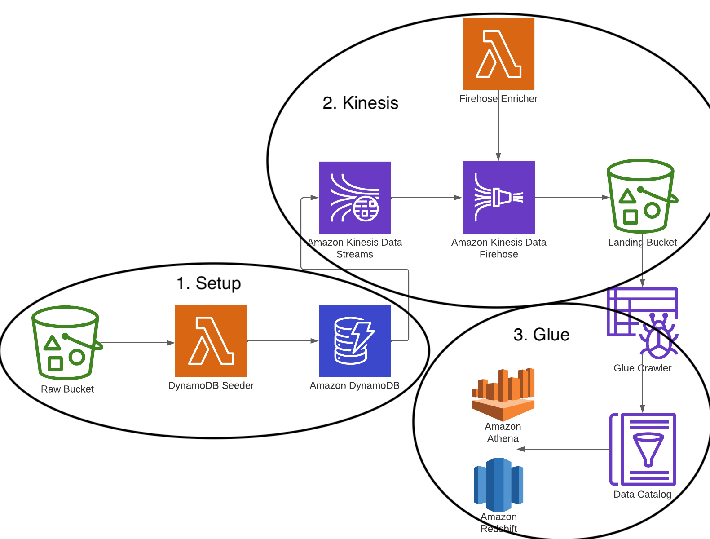

# CDK Kinesis Firehose Athena

---
Example cdk library demonstrating how to sync data originating from DynamoDB to a data warehouse using Kinesis Data
Streams and Kinesis Data Firehose.

This solution leverages the fairly
new [dynamic partitioning](https://docs.aws.amazon.com/firehose/latest/dev/dynamic-partitioning.html) feature from
kinesis to continuously partition streaming data in Kinesis Data Firehose by using keys within data (this example
uses `year`, `month`, `date` based on the createdAt field in the example dataset).

### Architecture


---

#### 1. Setup


To simulate an active application, data is seeded to the DynamoDB table after the infrastructure stack deploys via
the [s3 bucket deployment construct](https://docs.aws.amazon.com/cdk/api/v2/docs/aws-cdk-lib.aws_s3_deployment.BucketDeployment.html)
provided by the CDK.

The example data generation script can be found under `assets/data` and a bit more information on the dynamodb table
definition can be found
under [docs/architecture/data](https://github.com/bcgalvin/cdk-kinesis-firehose-athena/tree/main/docs/architecture/data)
.

The DynamoDB Seeder lambda function simply downloads the example data from the raw s3 bucket and then writes to dynamodb
via the `BatchWriteItem` operation. This api call accepts up to 25 records at a time so the input data is split into
chunks of that size and a goroutine is spawned to process each resulting slice.


<div style="text-align: center;"><i>The resulting dynamo table</i></div>   

#### 2. Kinesis


As the data producer outlined in the step above writes records to dynamo, the change data is forwarded to the attached
`kinesis stream`.

This change data contains the new record for insert operations to dynamo, new and old records for updates and the old
record for deletes. Since these are all inserts, the new rows get forwarded to the `kinesis firehose delivery stream`.

Kinesis firehose loads streaming data into data stores / analytics tools, and optionally is able to perform some data
transformations to the data as it lands. In our case the, `FirehoseEnricher` lambda performs the following operations to
records coming off the stream before finally outputting the data to s3:

```
- Subset data to exclude dynamodb primary and sort keys (`PK` & `SK`)
- Parses the `createdAt` attribute to extract the year, month and date to use as the partition
```

Kinesis Firehose also converts the data from json to parquet which is preferred for data lake architectures as its
columnar format is compressed and highly optimized for analytics workloads vs raw text in the form of json or csv.

<div style="text-align: center;"><i>Dynamic partitions generated from the createdAt field in Dynamodb</i></div>   

#### 3. Glue


The final step in this example is to make this data available to `Athena` and `Redshift Spectrum` through
the `Glue Data Catalog`.

The `Glue Data Catalog` is an index to the location, schema, and runtime metrics for data across aws storage services
such as S3, RDS and Redshift. In our case we need to register the S3 that was created in the previous step data with
Glue to make it queryable for the data team.

This is done automatically from running a `Glue Crawler` job to crawl the S3 location and register the file metadata
with the `Glue Catalog` (e.g. partition information, column types and row count). Once the crawler updates this
information, it becomes free to query in `Athena` and `Redshift Spectrum`.


<div style="text-align: center;"><i>The table in Athena now queryable to end users</i></div>

---

#### Orchestration

For this demonstration we used `Step Functions` to seed Dynamo with data and kick off the crawler using a basic wait
step to allow for processes to complete. In a more realistic scenario, we wouldn't need the seed operation and would set
the crawler to run based off of data landing in s3 or at a regular interval
using [EventBridge](https://aws.amazon.com/eventbridge/).

