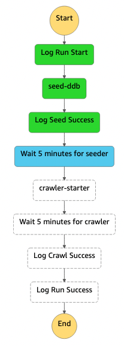

# CDK Kinesis Firehose Athena

---
Example cdk library demonstrating how to sync data originating from DynamoDB to a data warehouse using Kinesis Data
Streams and Kinesis Data Firehose.

This solution leverages the fairly
new [dynamic partitioning](https://docs.aws.amazon.com/firehose/latest/dev/dynamic-partitioning.html) feature from
kinesis to continuously partition streaming data in Kinesis Data Firehose by using keys within data (this example
uses `year`, `month`, `date` based on the createdAt field in the example dataset).

### Architecture

---

#### Setup

To simulate an active application, data is seeded to the DynamoDB table after the infrastructure stack deploys via
the [s3 bucket deployment construct](https://docs.aws.amazon.com/cdk/api/v2/docs/aws-cdk-lib.aws_s3_deployment.BucketDeployment.html)
provided by the CDK.

The example data generation script can be found under `assets/data` and a bit more information can be found
under [docs/architecture/data ](https://github.com/bcgalvin/cdk-kinesis-firehose-athena/tree/main/docs/architecture/data)

#### S3

#### Step Function

#### Athena Table

