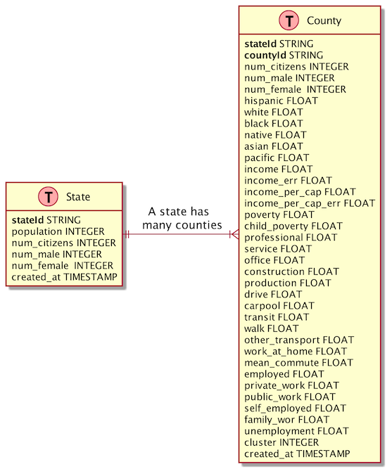

# Seed Data: Single Table Modeling

| Entity | PK                 | SK                   |
|--------|--------------------|----------------------|
| State  | STATE#\<StateName> | STATE#\<StateName>   |
| County | STATE#\<StateName> | COUNTY#\<CountyName> |

| Access Pattern        | Index      | Parameters            | Notes | 
|-----------------------|------------|-----------------------|-------|
| Get Counties By State | Main Table | Statename             |       |
| Get County            | Main Table | Statename, Countyname |
