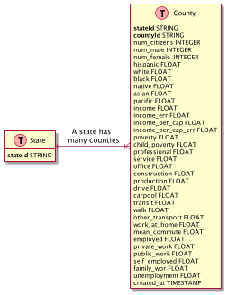

## Seed Data: Single Table Modeling

This dataset is admittedly not all that great to use for modeling in dynamo since there aren't any interesting access
patterns out of the box but I charged ahead anyhow since
the [sagemaker notebook](https://github.com/aws/amazon-sagemaker-examples/blob/main/introduction_to_applying_machine_learning/US-census_population_segmentation_PCA_Kmeans/sagemaker-countycensusclustering.ipynb)
these data come from is a nice end-to-end clustering example using PCA and KMeans.

--- 

### Entity-Relationship Diagram + Access Patterns

This application currently has two entities with one relationship but could be extended to include metadata on the
modeling runs such as PCA variance explained, principal component values and cluster loadings.

| Entity | PK                 | SK                   |
|--------|--------------------|----------------------|
| County | STATE#\<StateName> | COUNTY#\<CountyName> |

| Access Pattern        | Index      | Parameters            | Notes | 
|-----------------------|------------|-----------------------|-------|
| Get Counties By State | Main Table | StateName             |       |
| Get County            | Main Table | StateName, CountyName |       |    
